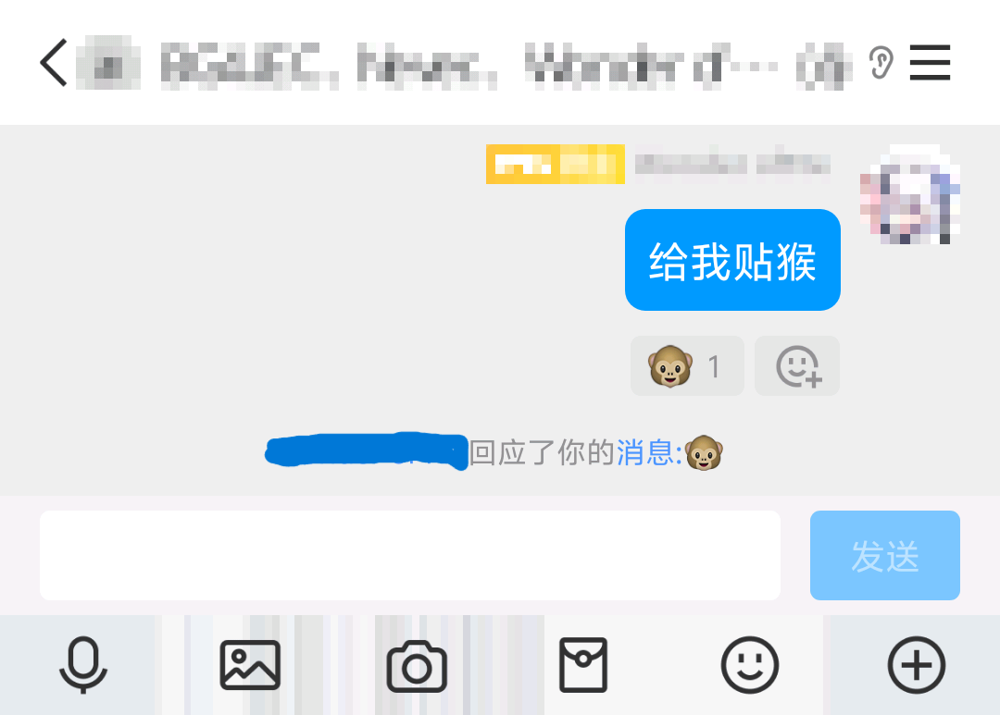
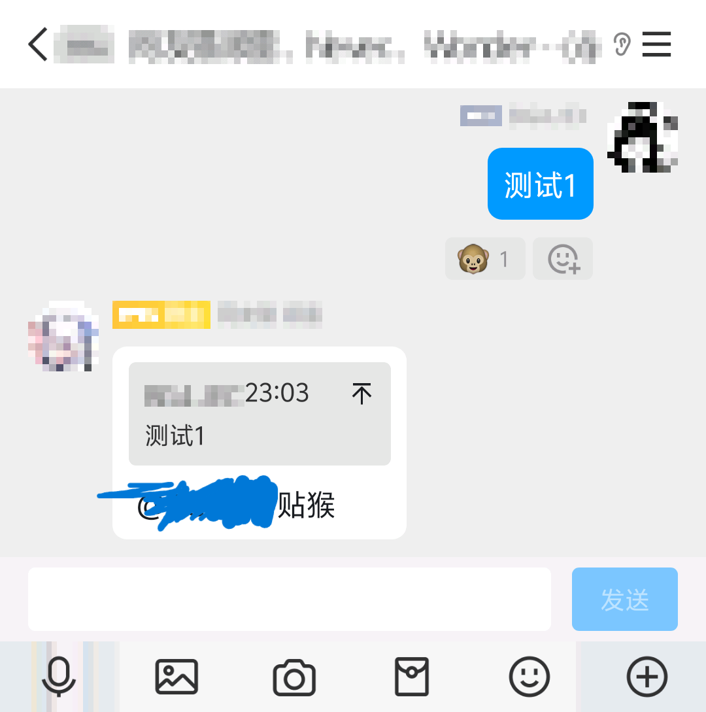
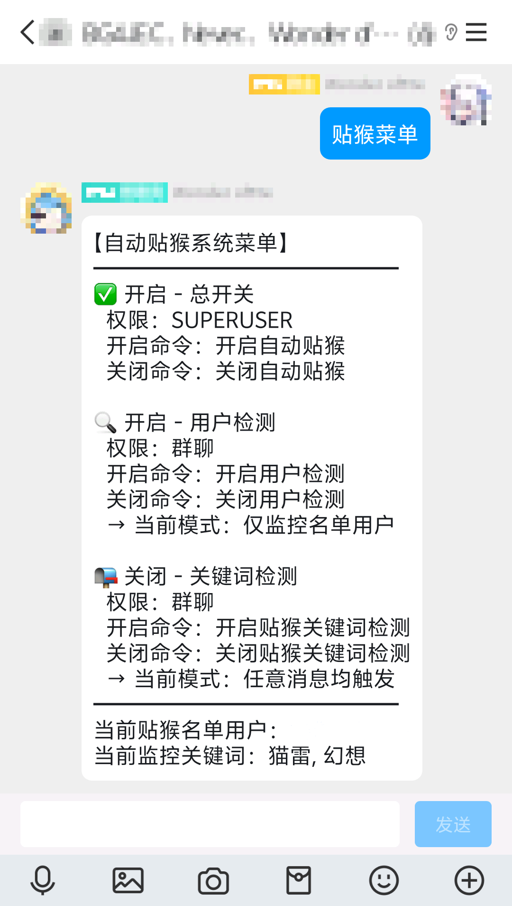

    

# nonebot-plugin-emojilike-automonkey

_✨ NoneBot onebotV11 贴猴插件，Fork form fllesser/nonebot-plugin-emojilike，Powered by Deepseek-R1 ✨_

## 📖 介绍

NoneBot onebotV11 贴猴插件，Fork form fllesser/nonebot-plugin-emojilike，Powered by Deepseek-R1  
配置好.env文件中的配置项后可以实现对特定QQ用户的包含特定关键词的信息进行贴猴，妈妈再也不用担心我的腱鞘炎了

## 💿 安装

pip

    pip install --upgrade nonebot-plugin-emojilike-automonkey

若你有大量插件依赖于 Pydantic V1 

    pip install --upgrade nonebot-plugin-emojilike-automonkey==12.0.0

打开 nonebot2 项目根目录下的 `pyproject.toml` 文件, 在 `[tool.nonebot]` 部分追加写入

    plugins = ["nonebot_plugin_emojilike_automonkey"]

## 🎉 使用
### .env中的配置项
| 配置项 | 注释 |
|:------------------------:|:-------------------------:|
| automonkey_users | 被贴猴的用户 |
示例:
automonkey_users=["12345678", "12345679"]

### 指令表
| 指令 | 权限 | 需要@ | 范围 | 说明 |
|:-----:|:----:|:----:|:----:|:----:|
| 赞我 | 群员 | 否 | 群聊 | 顾名思义 |
| 天天赞我 | 群员 | 否 | 群聊 | 顾名思义 |
| 给我贴猴 | 群员 | 否 | 群聊 | 顾名思义 |
| 开启/关闭自动贴猴 | SUPERUSER | 否 | 群聊 | 顾名思义 |
| 开启/关闭用户检测 | 群员 | 否 | 群聊 | 顾名思义 |
| 开启/关闭贴猴关键词检测 | 群员 | 否 | 群聊 | 顾名思义 |
| 增加/删除贴猴关键词+空格+关键词 | 群员 | 否 | 群聊 | 顾名思义 |
| 列出当前贴猴关键词 | 群员 | 否 | 群聊 | 顾名思义 |
| 贴猴菜单 | 群员 | 否 | 群聊 | 顾名思义 |

## 效果图

